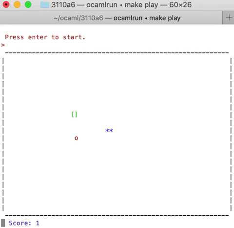
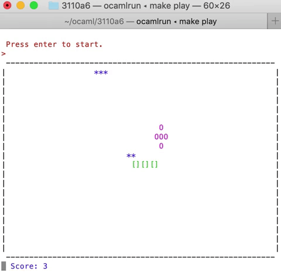
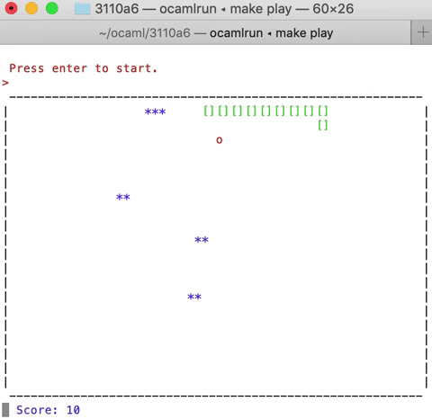

# OSnake

An original version of the classic Snake game, written in OCaml

## Instructions

Open the OSnake repo in terminal and then run `make play`. Press `enter` to start, and use the keys `W`, `A`, `S`, `D` to move the snake up, left, down, or right. Eat the apples (red o's) to grow the length of the snake (green []'s), which increases the score. Eat the power apples (purples O's) before they shrink to gain more points. Avoid the obstacles (blue \*'s) and border, or it's Game Over. The speed of the snake increases as the length increases, for an added challenge. Hold down `W`, `A`, `S`, or `D` to make the snake move even faster.

## Demo

The snake eats an apple and grows two segments
 
 

  

 
The snake eats a power apple and grows 5 segments
 
 

  

 
The snake hits an enemy and triggers Game Over
 
 

  

## Please Note

This code was written by Gemma Standley, Fauna Mahootian, and Yunshan Liu as a project for CS 3110 at Cornell University.
